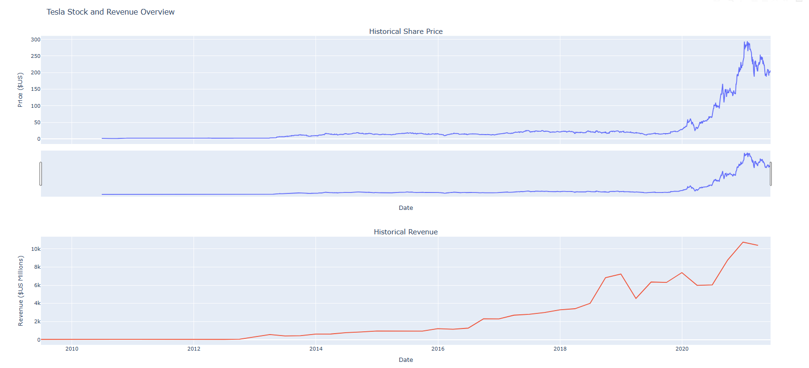
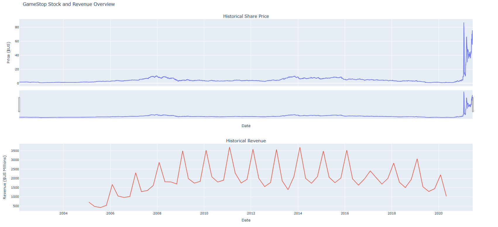

# Stock Data Extraction & Visualization — Tesla vs GameStop

This mini-project shows how I extract public market data (share prices via `yfinance`) and revenues (scraped from a static HTML page used in an IBM lab) — then visualize them in a clean, portfolio-ready way.

<div align="center">





</div>

## 🎯 Goals
- Fetch historical **share prices** (TSLA, GME) and **annual revenues**.
- Clean and align the data.
- Build clear, two-panel charts (Price ↑ / Revenue ↓).
- Communicate a few insights & limitations.

---

## 🧠 Thought Process
1. **Question framing** – Do price trends move with fundamentals? Where do they diverge?
2. **Acquire** – `yfinance` for prices; revenue parsed from a static HTML table.
3. **Clean** – Standardize date types & numeric revenue, remove commas, dollar signs, and blanks.
4. **Visualize** – Plotly figure with shared X-axis for easy comparison.
5. **Interpret** – Summarize what the visuals suggest (see below).

---

## ✨ Quick Insights
- **Tesla:** Revenue shows a sharp acceleration starting around 2019, followed by a major stock price rally in 2020–2021. The long-term trend in price aligns directionally with fundamentals, although price volatility is much higher than revenue growth.
- **GameStop:** Revenue remains flat to declining with clear retail seasonality. The dramatic 2021 price spike is disconnected from fundamentals, highlighting how market sentiment and speculative trading can dominate in the short term.

---

## 🗂 Structure
tesla-and-gamestop-stock-analysis/
```
├── figures/
│ ├── tesla_stock_revenue.png
│ └── gamestop_stock_revenue.png
├── src/
│ └── code/
│ └── stock_project.ipynb # main script
├── README.md
├── LICENSE
└── .gitignore
```
---

## 🔎 Notes & Limitations

Revenue figures are scraped from a static educational HTML file used in the IBM lab, not from official SEC filings. For production or investment purposes, always source data from authoritative, up-to-date filings or licensed APIs.

The analysis is limited to data up to mid-2021 to match the scope of the original lab. Extending to more recent data may change the observed relationships between price and revenue.

Price data is retrieved from Yahoo Finance via yfinance. While suitable for research and educational use, the data may differ slightly from official market feeds.

---

## 📜 License

This project is licensed under the 
[Creative Commons BY-NC-ND 4.0](https://creativecommons.org/licenses/by-nc-nd/4.0/)

You may view and learn from the content, but **you may not reuse, redistribute, or modify it** for commercial or derivative purposes without permission.

---

## 💬 Contact

Feel free to connect with me on [LinkedIn](https://linkedin.com/in/sidney-dang) or email at kyledang2711@gmail.com if you'd like to discuss this project or any opportunities.
